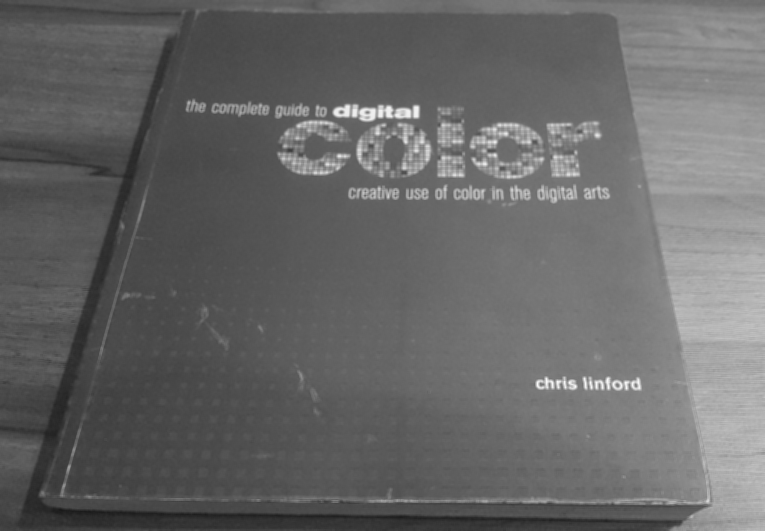

# GPU-Image-Processing-OpenCV4.1-Cuda-CPlusPlus
GPU Image processing using C++, Cuda and OpenCV4.1

Threshold example:

  <video width="320" height="200" src="resoultThreshold.gif" controls preload>

  
  

Blur with boxfilters example:

  
  
  

