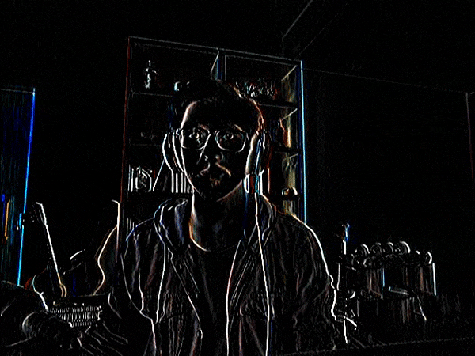

# GPU-Image-Processing-OpenCV4.1-Cuda-CPlusPlus
GPU Image processing using C++, Cuda and OpenCV4.1

Motion Detection Example:

Clahe Example:

Median Filtering Example:

Canny Edge Detection Example:

Sobel Example:

Threshold examples:

  
  

Blur with boxfilters example:

  
  
  

